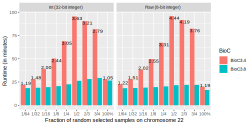

SeqArray: Data Management of Large-scale Whole-genome Sequence Variant Calls
===


[GNU General Public License, GPLv3](http://www.gnu.org/copyleft/gpl.html)

[](http://www.bioconductor.org/packages/release/bioc/html/SeqArray.html)
[](http://www.bioconductor.org/packages/release/bioc/html/SeqArray.html)
[](https://travis-ci.org/zhengxwen/SeqArray)
[](https://ci.appveyor.com/project/zhengxwen/seqarray)
[](https://codecov.io/github/zhengxwen/SeqArray?branch=master)


## Features

Data management of whole-genome sequence variant calls with hundreds of thousands of individuals: genotypic data (e.g., SNVs, indels and structural variation calls) and annotations in SeqArray GDS files are stored in an array-oriented and compressed manner, with efficient data access using the R programming language.

The SeqArray package is built on top of [Genomic Data Structure (GDS)](https://github.com/zhengxwen/gdsfmt) data format, and defines required data structure for a SeqArray file. GDS is a flexible and portable data container with hierarchical structure to store multiple scalable array-oriented data sets. It is suited for large-scale datasets, especially for data which are much larger than the available random-access memory. It also offers the efficient operations specifically designed for integers of less than 8 bits, since a diploid genotype usually occupies fewer bits than a byte. Data compression and decompression are available with relatively efficient random access. A high-level R interface to GDS files is available in the package [gdsfmt](https://github.com/zhengxwen/gdsfmt).


## Bioconductor:

Release Version: v1.22.6

[http://www.bioconductor.org/packages/release/bioc/html/SeqArray.html](http://www.bioconductor.org/packages/release/bioc/html/SeqArray.html)

* [Help Documents](http://zhengxwen.github.io/SeqArray/release/help/00Index.html)
* Tutorials: [Data Management](http://www.bioconductor.org/packages/release/bioc/vignettes/SeqArray/inst/doc/SeqArrayTutorial.html), [R Integration](http://www.bioconductor.org/packages/release/bioc/vignettes/SeqArray/inst/doc/R_Integration.html), [Overview Slides](http://www.bioconductor.org/packages/release/bioc/vignettes/SeqArray/inst/doc/OverviewSlides.html)
* [News](http://www.bioconductor.org/packages/release/bioc/news/SeqArray/NEWS)

Development Version: v1.23.9

[http://www.bioconductor.org/packages/devel/bioc/html/SeqArray.html](http://www.bioconductor.org/packages/devel/bioc/html/SeqArray.html)

* [Help Documents](http://zhengxwen.github.io/SeqArray/devel/help/00Index.html)
* Tutorials: [Data Management](http://www.bioconductor.org/packages/devel/bioc/vignettes/SeqArray/inst/doc/SeqArrayTutorial.html), [R Integration](http://www.bioconductor.org/packages/devel/bioc/vignettes/SeqArray/inst/doc/R_Integration.html), [Overview Slides](http://www.bioconductor.org/packages/devel/bioc/vignettes/SeqArray/inst/doc/OverviewSlides.html)
* [News](http://bioconductor.org/packages/devel/bioc/news/SeqArray/NEWS)


## Citation

Zheng X, Gogarten S, Lawrence M, Stilp A, Conomos M, Weir BS, Laurie C, Levine D (2017). SeqArray -- A storage-efficient high-performance data format for WGS variant calls. *Bioinformatics*. [DOI: 10.1093/bioinformatics/btx145](http://dx.doi.org/10.1093/bioinformatics/btx145).


## Installation (requiring ≥ R_v3.5.0)

* Bioconductor repository:
```R
if (!requireNamespace("BiocManager", quietly=TRUE))
    install.packages("BiocManager")
BiocManager::install("SeqArray")
```

* Development version from Github:
```R
library("devtools")
install_github("zhengxwen/gdsfmt")
install_github("zhengxwen/SeqArray")
```
The `install_github()` approach requires that you build from source, i.e. `make` and compilers must be installed on your system -- see the [R FAQ](http://cran.r-project.org/faqs.html) for your operating system; you may also need to install dependencies manually.

* Install the package from the source code:
[gdsfmt](https://github.com/zhengxwen/gdsfmt), [SeqArray](https://github.com/zhengxwen/SeqArray)
```sh
wget --no-check-certificate https://github.com/zhengxwen/gdsfmt/tarball/master -O gdsfmt_latest.tar.gz
wget --no-check-certificate https://github.com/zhengxwen/SeqArray/tarball/master -O SeqArray_latest.tar.gz
R CMD INSTALL gdsfmt_latest.tar.gz
R CMD INSTALL SeqArray_latest.tar.gz

## Or
curl -L https://github.com/zhengxwen/gdsfmt/tarball/master/ -o gdsfmt_latest.tar.gz
curl -L https://github.com/zhengxwen/SeqArray/tarball/master/ -o SeqArray_latest.tar.gz
R CMD INSTALL gdsfmt_latest.tar.gz
R CMD INSTALL SeqArray_latest.tar.gz
```


## SeqArray File Download

* [1000 Genomes Project](http://bochet.gcc.biostat.washington.edu/seqarray/1000genomes)


## Examples

```R
library(SeqArray)

gds.fn <- seqExampleFileName("gds")

# open a GDS file
f <- seqOpen(gds.fn)
# display the contents of the GDS file
f

# close the file
seqClose(f)
```

```R
## Object of class "SeqVarGDSClass"
## File: SeqArray/extdata/CEU_Exon.gds (298.6K)
## +    [  ] *
## |--+ description   [  ] *
## |--+ sample.id   { Str8 90 LZMA_ra(35.8%), 258B } *
## |--+ variant.id   { Int32 1348 LZMA_ra(16.8%), 906B } *
## |--+ position   { Int32 1348 LZMA_ra(64.6%), 3.4K } *
## |--+ chromosome   { Str8 1348 LZMA_ra(4.63%), 158B } *
## |--+ allele   { Str8 1348 LZMA_ra(16.7%), 902B } *
## |--+ genotype   [  ] *
## |  |--+ data   { Bit2 2x90x1348 LZMA_ra(26.3%), 15.6K } *
## |  |--+ ~data   { Bit2 2x1348x90 LZMA_ra(29.3%), 17.3K }
## |  |--+ extra.index   { Int32 3x0 LZMA_ra, 19B } *
## |  \--+ extra   { Int16 0 LZMA_ra, 19B }
## |--+ phase   [  ]
## |  |--+ data   { Bit1 90x1348 LZMA_ra(0.91%), 138B } *
## |  |--+ ~data   { Bit1 1348x90 LZMA_ra(0.91%), 138B }
## |  |--+ extra.index   { Int32 3x0 LZMA_ra, 19B } *
## |  \--+ extra   { Bit1 0 LZMA_ra, 19B }
## |--+ annotation   [  ]
## |  |--+ id   { Str8 1348 LZMA_ra(38.4%), 5.5K } *
## |  |--+ qual   { Float32 1348 LZMA_ra(2.26%), 122B } *
## |  |--+ filter   { Int32,factor 1348 LZMA_ra(2.26%), 122B } *
## |  |--+ info   [  ]
## |  |  |--+ AA   { Str8 1348 LZMA_ra(25.6%), 690B } *
## |  |  |--+ AC   { Int32 1348 LZMA_ra(24.2%), 1.3K } *
## |  |  |--+ AN   { Int32 1348 LZMA_ra(19.8%), 1.0K } *
## |  |  |--+ DP   { Int32 1348 LZMA_ra(47.9%), 2.5K } *
## |  |  |--+ HM2   { Bit1 1348 LZMA_ra(150.3%), 254B } *
## |  |  |--+ HM3   { Bit1 1348 LZMA_ra(150.3%), 254B } *
## |  |  |--+ OR   { Str8 1348 LZMA_ra(20.1%), 342B } *
## |  |  |--+ GP   { Str8 1348 LZMA_ra(24.4%), 3.8K } *
## |  |  \--+ BN   { Int32 1348 LZMA_ra(20.9%), 1.1K } *
## |  \--+ format   [  ]
## |     \--+ DP   [  ] *
## |        |--+ data   { Int32 90x1348 LZMA_ra(25.1%), 118.8K } *
## |        \--+ ~data   { Int32 1348x90 LZMA_ra(24.1%), 114.2K }
## \--+ sample.annotation   [  ]
##    \--+ family   { Str8 90 LZMA_ra(57.1%), 222B }
```


## Key Functions in the SeqArray Package

| Function      | Description |
|:--------------|:-------------------------------------------|
| seqVCF2GDS    | Reformat VCF files [»](https://rdrr.io/bioc/SeqArray/man/seqVCF2GDS.html) |
| seqSetFilter  | Define a data subset of samples or variants [»](https://rdrr.io/bioc/SeqArray/man/seqSetFilter.html) |
| seqGetData    | Get data from a SeqArray file with a defined filter [»](https://rdrr.io/bioc/SeqArray/man/seqGetData.html) |
| seqApply      | Apply a user-defined function over array margins [»](https://rdrr.io/bioc/SeqArray/man/seqApply.html) |
| seqBlockApply | Apply a user-defined function over array margins via blocking [»](https://rdrr.io/bioc/SeqArray/man/seqBlockApply.html) |
| seqParallel   | Apply functions in parallel [»](https://rdrr.io/bioc/SeqArray/man/seqParallel.html) |
| ...  | [»](https://rdrr.io/bioc/SeqArray/man/) |


## Benchmarks

### 1. Reading genotypes in random sample subsets (BioC release 3.8 vs 3.4)

(the number of samples is ~100k)



*Update ... (in progress)*


## File Format Conversion

[gds2bgen](https://github.com/zhengxwen/gds2bgen): Format Conversion Between GDS and BGEN


## Bug Fixes

* v1.22.0: fix `seqVCF2GDS()` and `seqBCF2GDS()` since reading from connections in text mode is buffered in R >= v3.5.0


## Also See

[PySeqArray](https://github.com/CoreArray/PySeqArray): data manipulation of whole-genome sequencing variant data in Python

[JSeqArray.jl](https://github.com/CoreArray/JSeqArray.jl): data manipulation of whole-genome sequencing variant data in Julia
