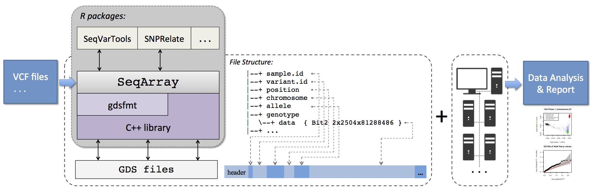

.

.

.

# Overview

The SeqArray file format is built on top of the Genomic Data Structure (GDS) format [@Zheng2012]. GDS is a flexible and scalable data container with a hierarchical structure that can store multiple array-oriented data sets. It is intended for use with large-scale genomic datasets, especially for those which are much larger than the available main memory. GDS provides memory and performance efficient operations specifically designed for integers of less than 8 bits, since a diploid genotype usually occupies fewer bits than a byte. Data compression and decompression are available with relatively efficient random access. Data compression and decompression are available with relatively efficient random access. GDS is implemented using an optimized C++ library (CoreArray, [http://corearray.sourceforge.net](http://corearray.sourceforge.net)) and a high-level R interface is provided by the platform-independent R package gdsfmt ([http://bioconductor.org/packages/gdsfmt](http://bioconductor.org/packages/gdsfmt)). Figure 1 shows the relationship between a SeqArray file and the underlying infrastructure upon which it is built. The minimum data fields required in a SeqArray file are sample and variant identifiers, variant chromosome, position and allele values and the value of the variant itself. SeqArray is a Bioconductor package [@Gentleman:2004aa; @R2016] available at [http://www.bioconductor.org/packages/SeqArray](http://www.bioconductor.org/packages/SeqArray) under the GNU General Public License v3.

.



**Figure 1**: SeqArray framework and flowchart. The SeqArray format is built on top of the Genomic Data Structure (GDS) format, and GDS is a generic data container with hierarchical structure for storing multiple array-oriented data sets. A high-level R interface to GDS files is provided in the gdsfmt package with a C++ library, and the SeqArray package offers functionalities specific to sequencing data. At a minimum a SeqArray file contains sample and variant identifiers, position, chromosome, reference and alternate alleles for each variant. Parallel computing environments, like multi-core computer clusters, are enabled with SeqArray. The functionality of SeqArray is extended by SeqVarTools, SNPRelate and other R/Bioconductor packages for WGS analyses.

.

SeqArray stores genotypes in a 2-bit array with ploidy, sample and variant dimensions. If two bits cannot represent all alleles at a site, a 2-bit matrix is appended to store additional bits according to the variant coordinate, hence any number of alleles can be stored including missing value. An indexing vector, associated with genotypes, is used to indicate how many bits for each variant. The INFO and FORMAT annotations in a SeqArray file can be integers, floating point numbers and characters. For a variant, variable-length vectors in an annotation are padded with missing values, and all vectors are packed together in an array. If each variant has different length, an extra vector is used to store the length information.

Multiple lossless compression methods are available in the SeqArray format, and users can select the Lempel-Ziv Markov chain (LZMA) algorithm to compress data instead of the zlib algorithm. LZMA has a higher compression ratio than zlib and is implemented in a command-line tool `xz` ([http://tukaani.org/xz](http://tukaani.org/xz)) with a C library `liblzma`. Internally, the C++ kernel links to `liblzma` and calls the deflate and inflate functions. A new compression algorithm could be incorporated to the SeqArray format without changing the application program interface.

To enable efficient random access of compressed data, a storage strategy using independent compression data blocks is employed and an indexing strategy is maintained internally. A fast performance for data filtering could be obtained since not all data have to be decompressed.


## Parallel Computing

SeqArray utilizes the framework implemented in the R core package `parallel` [@Rossini2007; @R2016] to support multiple forms of parallelism. First, multi-core parallelism on symmetric multiprocessing (SMP) computer architectures is supported via lightweight forking on Unix-like systems. Second, job-level parallelism on loosely coupled computer clusters is supported with communicating over sockets or Message Passing Interface (MPI). Most importantly, all of these forms of parallelism can be combined together allowing high-speed access and operations on hundreds of different parts of the genome simultaneously. 

For data writing with multiple processes, SeqArray stores data in separate local files according to each process and merges all files together when the processes finish. Since data are stored in independent blocks, merging files could be as easy as copying data directly without re-compression.


## Application Program Interface (API)

.

**Table 1**: The key functions in the SeqArray package.

| Function     | Description |
|:-------------|:-------------------------------------------|
| seqVCF2GDS   | Reformat VCF files. [](http://zhengxwen.github.io/SeqArray/release/help/seqVCF2GDS.html)  |
| seqSetFilter | Define a data subset of samples or variants. [](http://zhengxwen.github.io/SeqArray/release/help/seqSetFilter.html)  |
| seqGetData   | Get data from a SeqArray file with a defined filter. [](http://zhengxwen.github.io/SeqArray/release/help/seqGetData.html)  |
| seqApply     | Apply a user-defined function over array margins. [](http://zhengxwen.github.io/SeqArray/release/help/seqApply.html)  |
| seqParallel  | Apply functions in parallel. [](http://zhengxwen.github.io/SeqArray/release/help/seqParallel.html)  |

.

Genotypic data and annotations are stored in an array-oriented manner, providing efficient data access using the R programming language. There are five key functions in SeqArray as shown in Table 1, and many of data analyses can be done using just these functions.

`seqVCF2GDS()` converts VCF format files to SeqArray. Multiple cores within one or more compute nodes in a compute cluster can be used to simultaneously to reformat data. Since `seqVCF2GDS()` utilizes R's connection interface to read VCF files incrementally, it is able to import data from http/ftp texts and any other data source from a pipe with a command-line tool.

`seqSetFilter()` and `seqGetData()` can be used together to retrieve data for a selected set of samples from a defined genomic region. `GRange` and `GRangesList` objects defined in the Bioconductor core packages are supported via `seqSetFilter()` [@Gentleman:2004aa; @Lawrence2013].

`seqApply()` applies a user-defined function to margins of genotypes and annotations. The function that is applied can be defined in R as is typical, or via C/C++ code using the Rcpp package [@eddelbuettel2011rcpp].

`seqParallel()` utilizes the facilities offered by the parallel package [@Rossini2007; @R2016] to perform calculations on a SeqArray file in parallel. The examples using these key functions are shown in the section of R integration.

.

.

.

.

.

.

.


# Preparing Data

```{r echo=FALSE}
options(width=110L)
```

```{r}
# load the R package SeqArray
library(SeqArray)

library(Rcpp)
```

## Data Format used in SeqArray

Let us use the GDS file in the SeqArray package:
```{r}
gds.fn <- seqExampleFileName("gds")
# or gds.fn <- "C:/YourFolder/Your_GDS_File.gds"
gds.fn

seqSummary(gds.fn)
```
`seqExampleFileName()` returns the file name of a GDS file of SeqArray format used as an example in [SeqArray](http://www.bioconductor.org/packages/release/bioc/html/SeqArray.html), and it is a subset of data from the 1000 Genomes Project. `seqSummary()` summarizes the genotypes and annotations.

```{r}
# open a GDS file
genofile <- seqOpen(gds.fn)

# display the contents of the SeqArray file in a hierarchical structure
genofile
```

For those who would like to know how variable-length genotypic data and annotations are stored in an array-oriented manner, `print(..., all=TRUE)` displays all contents including hidden structures:
```{r}
# display all contents of the GDS file
print(genofile, all=TRUE, attribute=TRUE)

# close the GDS file
seqClose(genofile)
```

The output lists all variables stored in the GDS file. At the first level, it stores variables `sample.id`, `variant.id`, etc. The additional information are displayed in the braces indicating data type, size, compressed or not and compression ratio, where `Bit2` indicates that each byte encodes up to four alleles since one byte consists of eight bits, and `Str8` indicates variable-length character. The annotations are stored in the directory `annotation`, which includes the fields of ID, QUAL, FILTER, INFO and FORMAT corresponding to the original VCF file(s). All of the functions in [SeqArray](http://www.bioconductor.org/packages/release/bioc/html/SeqArray.html) require a minimum set of variables in the annotation data:

1. `sample.id`, a unique identifier for each sample.
2. `variant.id`, a unique identifier for each variant.
3. `position`, integer, the base position of each variant on the chromosome, and 0 or NA for unknown position.
4. `chromosome`, character, the chromosome code, e.g., 1-22 for autosomes, X, Y, XY (the pseudoautosomal region), M (the mitochondrial probes), and `` (a blank string) for probes with unknown chromosome.
5. `allele`, character, reference and alternative alleles using comma as a separator.
6. `genotype`, a folder:
    1. `data`, a 3-dimensional array for genotypic data, the first dimension refers to the number of ploidy, the second is sample and the third is variant.
    2. `~data`, an optional variable, the transposed array according to `data`, the second dimension is variant and the third is sample.
    3. `@data`, the index for the variable `data`, and the prefix `@` is used to indicate the index. It should be equal-size as `variant.id`, which is used to specify the data size of each variant.
    4. `extra.index`, an index (3-by-$*$) matrix for triploid call (look like `0/0/1` in the VCF file). E.g., for `0/0/1`, the first two alleles are stored in `data`, and the last allele is saved in the variable `extra`. For each column of `extra.index`, the first value is the index of sample (starting from 1), the second value is the index of variant (starting from 1), and the last value is how many alleles remain (usually it is 1 since the first two alleles are stored in `data`) that indicates how many alleles stored in `extra` contiguously.
    5. `extra`, one-dimensional array, the additional data for triploid call, each allele block corresponds to each column in `extra.index`.

The optional folders include `phase` (phasing information), `annotation`, and `sample.annotation`.

* The folder `phase` includes:

1. `data`, a matrix or 3-dimensional array for phasing information. `0` for unphased status and `1` for phased status. If it is a matrix, the first dimension is sample and the second is variant, corresponding to diploid genotypic data. If it is a 3-dimensional array, the first dimension refers to the number of ploidy minus one. More details about `/` and `|` in a VCF file can be founded: [VCF format](http://www.1000genomes.org/wiki/analysis/variant-call-format).
2. `~data`, an optional variable, the transposed array according to `data`, the second dimension is variant and the third is sample.
3. `extra.index`, an index (3-by-$*$) matrix for triploid call (look like `0/0/1` in the VCF file). E.g., for `0/0/1`, the first separator (`/` here) is stored in `data`, and the last separator is saved in the variable `extra`. For each column of `extra.index`, the first value is the index of sample (starting from 1), the second value is the index of variant (starting from 1), and the last value is how many separators remain (usually it is 1 since the first separator is stored in `data`) that indicates how many separator stored in `extra` contiguously.
4. `extra`, one-dimensional array, the additional data of separator indicator for triploid call, each separator block corresponds to each column in `extra.index`.

* The folder `annotation` includes:

1. `id`, ID semi-colon separated list of unique identifiers where available. If this is a dbSNP variant it is encouraged to use the rs number(s). No identifier should be present in more than one data record. If there is no identifier available, then a blank string is used.
2. `qual`, phred-scaled quality score for the assertion made in ALT.
3. `filter`, PASS if this position has passed all filters, i.e. a call is made at this position.
4. `info`, a vector or a matrix, additional information for each variant, according to the INFO field in a VCF file,
    1. `VARIABLE_NAME`, variable. If it is fixed-length, missing value indicates that there is no entry for that variant in the VCF file.
    2. `@VARIABLE_NAME` (*optional*). If `VARIABLE_NAME` is variable-length, one-dimensional array. The prefix `@` is used to indicate the index data. It should be equal-size as `variant.id`, which is used to specify the data size of each variant.
    3. `OTHER_VARIABLES`, ...
5. `format`, additional information for each variant and sample, according to the FORMAT field in a VCF file,
    1. `VARIABLE_NAME`, a folder,
        1. `data`, a $n_{samp}$-by-$*$ matrix.
        2. `~data`, an optional variable, the transposed array according to `data`.
        3. `@data`, one-dimensional array, the index data for the variable `data`, and the prefix `@` is used to indicate the index data. It should be equal-size as `variant.id`, which is used to specify the data size of each variant.
    2. `OTHER_VARIABLES`, ...

* The folder `sample.annotation` contains variables of vector or matrix according to `sample.id`.


## Format Conversion from VCF Files

The [SeqArray](http://www.bioconductor.org/packages/release/bioc/html/SeqArray.html) package provides a function `seqVCF2GDS()` to reformat a VCF file, and it allows merging multiple VCF files during format conversion. The genotypic and annotation data are stored in a compressed manner.

```{r}
# the VCF file, using the example in the SeqArray package
vcf.fn <- seqExampleFileName("vcf")
# or vcf.fn <- "C:/YourFolder/Your_VCF_File.vcf"
vcf.fn

# parse the header
seqVCF_Header(vcf.fn)
```

The columns `Number`, `Type` and `Description` are defined by the 1000 Genomes Project: [VCF format](http://www.1000genomes.org/wiki/Analysis/Variant Call Format/vcf-variant-call-format-version-41). Briefly, the Number entry is an Integer that describes the number of values that can be included with the INFO field. For example, if the INFO field contains a single number, then this value should be 1; if the INFO field describes a pair of numbers, then this value should be 2 and so on. If the field has one value per alternate allele then this value should be `A`; if the field has one value for each possible genotype then this value should be `G`.  If the number of possible values varies, is unknown, or is unbounded, then this value should be `.`. The `Flag` type indicates that the INFO field does not contain an entry, and hence the Number should be 0 in this case. Possible Types for FORMAT fields are: Integer, Float, Character, and String (this field is otherwise defined precisely as the INFO field).

```{r}
# convert, save in "tmp.gds"
seqVCF2GDS(vcf.fn, "tmp.gds")

# maximize the compression level with zlib compression
seqVCF2GDS(vcf.fn, "tmp.gds", storage.option="ZIP_RA.max", verbose=FALSE)

# compress data with LZMA compression algorithm
seqVCF2GDS(vcf.fn, "tmp.gds", storage.option="LZMA_RA.max", verbose=FALSE)

seqSummary("tmp.gds")
```

```{r echo=FALSE}
unlink("tmp.gds")
```


## Export to VCF Files

The [SeqArray](http://www.bioconductor.org/packages/release/bioc/html/SeqArray.html) package provides a function `seqGDS2VCF()` to export data to a VCF file. The arguments `info.var` and `fmt.var` in `seqGDS2VCF` allow users to specify the variables listed in the INFO and FORMAT fields of VCF format, or remove the INFO and FORMAT information. `seqSetFilter()` can be used to define a subset of data for the export.

```{r}
# the file of GDS
gds.fn <- seqExampleFileName("gds")
# or gds.fn <- "C:/YourFolder/Your_GDS_File.gds"

# open a GDS file
genofile <- seqOpen(gds.fn)

# convert
seqGDS2VCF(genofile, "tmp.vcf.gz")
# read
s <- readLines("tmp.vcf.gz", n=22)
s[nchar(s) > 80] <- paste(substr(s[nchar(s) > 80], 1, 80), "...")
cat(s, sep="\n")

# output BN,GP,AA,HM2 in INFO (the variables are in this order), no FORMAT
seqGDS2VCF(genofile, "tmp2.vcf.gz", info.var=c("BN","GP","AA","HM2"),
    fmt.var=character())
# read
s <- readLines("tmp2.vcf.gz", n=16)
s[nchar(s) > 80] <- paste(substr(s[nchar(s) > 80], 1, 80), "...")
cat(s, sep="\n")

# close the GDS file
seqClose(genofile)
```

Users can use `diff`, a command line tool in Unix-like systems, to compare files line by line, in order to confirm data consistency.
```sh
# assuming the original VCF file is old.vcf.gz,
# call "seqVCF2GDS" for the import and "seqGDS2VCF" for the export to create a new VCF file tmp.vcf.gz
$ diff <(zcat old.vcf.gz) <(zcat tmp.vcf.gz)
# OR
$ diff <(gunzip -c old.vcf.gz) <(gunzip -c tmp.vcf.gz)
```

```
1a2,3
> ##fileDate=20130309
> ##source=SeqArray_RPackage_v1.0

# LOOK GOOD! There are only two lines different, and both are in the header.
```

```{r}
# delete temporary files
unlink(c("tmp.vcf.gz", "tmp1.vcf.gz", "tmp2.vcf.gz"))
```


## Modification

The [SeqArray](http://www.bioconductor.org/packages/release/bioc/html/SeqArray.html) package provides a function `seqDelete()` to
remove data annotations in the INFO and FORMAT fields. It is suggested to use `cleanup.gds()` in the [gdsfmt](http://www.bioconductor.org/packages/release/bioc/html/gdsfmt.html) package after calling `seqDelete()` to reduce the file size. For example,

```{r}
# the file of VCF
vcf.fn <- seqExampleFileName("vcf")
# or vcf.fn <- "C:/YourFolder/Your_VCF_File.vcf"

# convert
seqVCF2GDS(vcf.fn, "tmp.gds", verbose=FALSE)

# make sure that open with "readonly=FALSE"
genofile <- seqOpen("tmp.gds", readonly=FALSE)

# display the original structure
genofile

# delete "HM2", "HM3", "AA", "OR" and "DP"
seqDelete(genofile, info.varname=c("HM2", "HM3", "AA", "OR"), format.varname="DP")

# display
genofile

# close the GDS file
seqClose(genofile)

# clean up the fragments to reduce the file size
cleanup.gds("tmp.gds")
```

```{r echo=FALSE}
unlink("tmp.gds")
```

.

.

.

.

.

.

.


# Data Processing

## Functions for Data Analysis

**Table 2**: A list of functions for data analysis.

| Function       | Description |
|:---------------|:-------------------------------------------|
| seqGetData     | Gets data from a sequence GDS file (from a subset of data). [](http://zhengxwen.github.io/SeqArray/release/help/seqGetData.html)  |
| seqApply       | Applies a user-defined function over array margins. [](http://zhengxwen.github.io/SeqArray/release/help/seqApply.html)  |
| seqNumAllele   | Numbers of alleles per site. [](http://zhengxwen.github.io/SeqArray/release/help/seqNumAllele.html)  |
| seqMissing     | Missing genotype percentages. [](http://zhengxwen.github.io/SeqArray/release/help/seqMissing.html)  |
| seqAlleleFreq  | Allele frequencies. [](http://zhengxwen.github.io/SeqArray/release/help/seqAlleleFreq.html)  |
| seqAlleleCount | Allele counts. [](http://zhengxwen.github.io/SeqArray/release/help/seqAlleleCount.html)  |
| ...            | [](http://zhengxwen.github.io/SeqArray/release/help/00Index.html)  |

.

## Get Data

```{r}
# open a GDS file
gds.fn <- seqExampleFileName("gds")
genofile <- seqOpen(gds.fn)
```

It is suggested to use `seqGetData()` to take out data from the GDS file since this function can take care of variable-length data and multi-allelic genotypes, although users could also use `read.gdsn()` in the [gdsfmt](http://www.bioconductor.org/packages/release/bioc/html/gdsfmt.html) package to read data.

```{r}
# take out sample id
head(samp.id <- seqGetData(genofile, "sample.id"))

# take out variant id
head(variant.id <- seqGetData(genofile, "variant.id"))

# get "chromosome"
table(seqGetData(genofile, "chromosome"))

# get "allele"
head(seqGetData(genofile, "allele"))

# get "annotation/info/GP"
head(seqGetData(genofile, "annotation/info/GP"))

# get "sample.annotation/family"
head(seqGetData(genofile, "sample.annotation/family"))
```

Users can set a filter to samples and/or variants by `seqSetFilter()`. For example, a subset consisting of three samples and four variants:
```{r}
# set sample and variant filters
seqSetFilter(genofile, sample.id=samp.id[c(2,4,6)])
set.seed(100)
seqSetFilter(genofile, variant.id=sample(variant.id, 4))

# get "allele"
seqGetData(genofile, "allele")
```

Get genotypic data, it is a 3-dimensional array with respect to allele, sample and variant. `0` refers to the reference allele (or the first allele in the variable `allele`), `1` for the second allele, and so on, while NA is missing allele.
```{r}
# get genotypic data
seqGetData(genofile, "genotype")
```

Now let us take a look at a variable-length dataset `annotation/info/AA`, which corresponds to the INFO column in the original VCF file. There are four variants, each variant has data with size ONE (`$length`), and data are saved in `$data` contiguously.
`$length` could be ZERO indicating no data for that variant.
```{r}
# get "annotation/info/AA", a variable-length dataset
seqGetData(genofile, "annotation/info/AA")
```

Another variable-length dataset is `annotation/format/DP` corresponding to the FORMAT column in the original VCF file. Again, `$length` refers to the size of each variant, and data are saved in `$data` contiguously with respect to the dimension `variant`. `$length` could be ZERO indicating no data for that variant.
```{r}
# get "annotation/format/DP", a variable-length dataset
seqGetData(genofile, "annotation/format/DP")
```


## Apply Functions Over Array Margins

[SeqArray](http://www.bioconductor.org/packages/release/bioc/html/SeqArray.html) provides `seqApply()` to apply a user-defined function over array margins, which is coded in C++. It is suggested to use `seqApply()` instead of `apply.gdsn()` in the [gdsfmt](http://www.bioconductor.org/packages/release/bioc/html/gdsfmt.html) package, since this function can take care of variable-length data and multi-allelic genotypes. For example, reading the two variables `genotype` and `annotation/id` variant by variant:
```{r}
# set sample and variant filters
set.seed(100)
seqSetFilter(genofile, sample.id=samp.id[c(2,4,6)], variant.id=sample(variant.id, 4))

# read multiple variables variant by variant
seqApply(genofile, c(geno="genotype", id="annotation/id"), FUN=print, margin="by.variant", as.is="none")

# read genotypes sample by sample
seqApply(genofile, "genotype", FUN=print, margin="by.sample", as.is="none")

seqApply(genofile, c(sample.id="sample.id", genotype="genotype"), FUN=print, margin="by.sample", as.is="none")
```

```{r}
# remove the sample and variant filters
seqResetFilter(genofile)

# get the numbers of alleles per variant
z <- seqApply(genofile, "allele",
    FUN=function(x) length(unlist(strsplit(x,","))), as.is="integer")
table(z)
```

Another example is to use the argument `var.index` in the function `seqApply()` to include external information in the analysis, where the variable `index` in the user-defined `FUN` is an index of the specified dimension starting from 1 (e.g., variant).
```{r}
HM3 <- seqGetData(genofile, "annotation/info/HM3")

# Now HM3 is a global variable
# print out RS id if the frequency of reference allele is less than 0.5% and it is HM3
seqApply(genofile, c(geno="genotype", id="annotation/id"),
    FUN = function(index, x) {
        p <- mean(x$geno == 0, na.rm=TRUE)  # the frequency of reference allele
        if ((p < 0.005) & HM3[index]) print(x$id)
    }, as.is="none", var.index="relative", margin="by.variant")
```


## Apply Functions in Parallel

Now, let us consider an example of calculating the frequency of reference allele, and this calculation can be done using `seqApply()` and `seqParallel()`. Let's try the uniprocessor implementation first.
```{r}
# calculate the frequency of reference allele,
afreq <- seqApply(genofile, "genotype", FUN=function(x) mean(x==0L, na.rm=TRUE),
    as.is="double", margin="by.variant")
length(afreq)
summary(afreq)
```

A multi-process implementation:
```{r}
# load the "parallel" package
library(parallel)

# choose an appropriate cluster size (or # of cores)
seqParallelSetup(2)

# run in parallel
afreq <- seqParallel(, genofile, FUN = function(f) {
        seqApply(f, "genotype", as.is="double", FUN=function(x) mean(x==0L, na.rm=TRUE))
    }, split = "by.variant")

length(afreq)
summary(afreq)

# Close the GDS file
seqClose(genofile)
```

.

.

.

.

.

.

.


# Examples

In this section, a GDS file shipped with the package is used as an example:
```{r}
# open a GDS file
gds.fn <- seqExampleFileName("gds")
genofile <- seqOpen(gds.fn)
```

## The performance of seqApply

Let us try three approaches to export unphased genotypes: 1) the for loop in R; 2) vectorize the function in R; 3) the for loop in `seqApply()`. The function `seqApply()` has been highly optimized by blocking the computations to exploit the high-speed memory instead of disk. The results of running times (listed as follows) indicate that `seqApply()` works well and is comparable with vectorization in R (the benchmark in R_v3.0).

1. the for loop in R:

```R
system.time({
    geno <- seqGetData(genofile, "genotype")
    gc <- matrix("", nrow=dim(geno)[2], ncol=dim(geno)[3])
    for (i in 1:dim(geno)[3])
    {
        for (j in 1:dim(geno)[2])
        gc[j,i] <- paste(geno[1,j,i], geno[2,j,i], sep="/")
    }
    gc[gc == "NA/NA"] <- NA
    gc
})

   user  system elapsed
  2.185   0.019   2.386       <- the function takes 2.4 seconds

dim(gc)
[1]   90 1348

table(c(gc))
  0/0   0/1   1/0   1/1  <NA> 
88350  7783  8258  8321  8608 
```

2. Vectorize the function in R:

```R
system.time({
    geno <- seqGetData(genofile, "genotype")
    gc <- matrix(paste(geno[1,,], geno[2,,], sep="/"),
        nrow=dim(geno)[2], ncol=dim(geno)[3])
    gc[gc == "NA/NA"] <- NA
    gc
})

   user  system elapsed
  0.134   0.002   0.147       <- the function takes 0.15 seconds
```

3. the for loop in `seqApply()`:

```R
system.time({
    gc <- seqApply(genofile, "genotype",
        function(x) { paste(x[1,], x[2,], sep="/") },
        margin="by.variant", as.is="list")
    gc2 <- matrix(unlist(gc), ncol=length(gc))
    gc2[gc2 == "NA/NA"] <- NA
    gc2
})

   user  system elapsed
  0.157   0.002   0.168       <- the function takes 0.17 seconds
```

.

.

## Missing Rates for Variants

### seqApply

```{r}
# apply the function marginally
m.variant <- seqApply(genofile, "genotype", function(x) mean(is.na(x)),
    margin="by.variant", as.is="double", .progress=TRUE)
# output
length(m.variant); summary(m.variant)
```

### C++ Integration

```{r}
cppFunction("
    double mean_na(IntegerVector x)
    {
        int len=x.size(), n=0;
        for (int i=0; i < len; i++)
        {
            if (x[i] == NA_INTEGER) n++;
        }
        return double(n) / len;
    }")

summary(seqApply(genofile, "genotype", mean_na, margin="by.variant", as.is="double"))
```

### seqBlockApply

```{r}
# apply the function marginally
m.variant <- seqBlockApply(genofile, "genotype", function(x) {
        colMeans(is.na(x), dims=2L)
    }, margin="by.variant", as.is="unlist")
# output
summary(m.variant)
```

### seqBlockApply + Parallel

```{r}
# apply the function marginally with two cores
m.variant <- seqBlockApply(genofile, "genotype", function(x) colMeans(is.na(x), dims=2L),
    margin="by.variant", as.is="unlist", parallel=2)
# output
summary(m.variant)
```

### seqMissing

```{r}
# Or call the function in SeqArray
summary(seqMissing(genofile, per.variant=TRUE))
```

.

.

## Missing Rates for Samples

### seqApply

```{r}
# get ploidy, the number of samples and variants
# dm[1] -- ploidy, dm[2] -- # of selected samples, dm[3] -- # of selected variants
dm <- seqSummary(genofile, "genotype", verbose=FALSE)$seldim

# an initial value
n <- 0L

# apply the function marginally
seqApply(genofile, "genotype", function(x) {
        n <<- n + is.na(x)    # use "<<-" operator to update 'n' in the parent environment
    }, margin="by.variant", .progress=TRUE)

# output
m.samp <- colMeans(n) / dm[3L]
length(m.samp); summary(m.samp)
```

### C++ Integration

```{r}
cppFunction("
    void add_na_num(IntegerVector x, IntegerVector num)
    {
        int len=x.size();
        for (int i=0; i < len; i++)
        {
            if (x[i] == NA_INTEGER) num[i]++;
        }
    }")

n <- matrix(0L, nrow=dm[1L], ncol=dm[2L])
seqApply(genofile, "genotype", add_na_num, margin="by.variant", num=n)

summary(colMeans(n) / dm[3L])
```

### seqBlockApply

```{r}
# an initial value
n <- 0L

# apply the function marginally
seqBlockApply(genofile, "genotype", function(x) {
        n <<- n + rowSums(is.na(x), dims=2L)    # use "<<-" operator to update 'n' in the parent environment
    }, margin="by.variant")

# output
m.samp <- colMeans(n) / dm[3L]
summary(m.samp)
```

### seqBlockApply + Parallel

```{r}
# the datasets are automatically split into two non-overlapping parts
n <- seqParallel(2, genofile, FUN = function(f)
    {
        n <- 0L    # an initial value
        seqBlockApply(genofile, "genotype", function(x) {
            n <<- n + rowSums(is.na(x), dims=2L)    # use "<<-" operator to update 'n' in the parent environment
        }, margin="by.variant")
        n    #output
    }, .combine = "+",     # sum "n" of different processes together
    split = "by.variant")

# output
m.samp <- colMeans(n) / dm[3L]
summary(m.samp)
```

### seqMissing

```{r}
# Call the function in SeqArray
summary(seqMissing(genofile))
```

.

.

## Allele Frequency

### seqApply

```{r}
# apply the function variant by variant
afreq <- seqApply(genofile, "genotype", FUN=function(x) mean(x==0L, na.rm=TRUE),
    as.is="double", margin="by.variant", .progress=TRUE)

length(afreq); summary(afreq)
```

### C++ Integration

```{r}
cppFunction("
    double calc_freq(IntegerVector x)
    {
        int len=x.size(), n=0, n0=0;
        for (int i=0; i < len; i++)
        {
            int g = x[i];
            if (g != NA_INTEGER)
            {
                n++;
                if (g == 0) n0++;
            }
        }
        return double(n0) / n;
    }")

summary(seqApply(genofile, "genotype", FUN=calc_freq, as.is="double", margin="by.variant"))
```

### seqBlockApply

```{r}
# apply the function variant by variant
afreq <- seqBlockApply(genofile, "genotype", FUN=function(x) {
        colMeans(x==0L, na.rm=TRUE, dims=2L)
    }, as.is="unlist", margin="by.variant")

summary(afreq)
```

### seqBlockApply + Parallel

```{r}
# apply the function over variants with two cores
afreq <- seqBlockApply(genofile, "genotype", FUN=function(x) {
        colMeans(x==0L, na.rm=TRUE, dims=2L)
    }, as.is="unlist", margin="by.variant", parallel=2)

summary(afreq)
```

### seqAlleleFreq

```{r}
# Call the function in SeqArray
summary(seqAlleleFreq(genofile))
```

.

.

## Principal Component Analysis

In the principal component analysis [@Patterson:2006:PLoS-Genet:17194218], we employ the dosage of reference alleles to avoid confusion of multiple alleles. The genetic covariance matrix is defined as $M = [ m_{j,j'} ]$:
\[
    m_{j,j'} = \frac{1}{L} \sum_{l=1}^L
    	\frac{(g_{j,l} - 2p_l)(g_{j',l} - 2p_l)}{p_l (1 - p_l)}
\]
where $g_{j,l}$ is a genotype of individual $j$ at locus $l$ ($\in \{0,1,2\}$, Num. of reference allele), $p_l$ is the frequency of reference allele and there are $L$ loci in total.


### seqApply

```{r}
# covariance variable with an initial value
s <- 0

seqApply(genofile, "$dosage", function(x)
    {
        p <- 0.5 * mean(x, na.rm=TRUE)    # allele frequency
        g <- (x - 2*p) / sqrt(p*(1-p))    # normalization
        g[is.na(g)] <- 0                  # missing values
        s <<- s + (g %o% g)               # update the cov matrix 's' in the parent environment
    }, margin="by.variant", .progress=TRUE)

# scaled by the number of samples over the trace
s <- s * (nrow(s) / sum(diag(s)))
# eigen-decomposition
eig <- eigen(s)

# eigenvalues
head(eig$value)
```

```{r fig.width=4, fig.height=4, fig.align='center'}
# eigenvectors
plot(eig$vectors[,1], eig$vectors[,2], xlab="PC 1", ylab="PC 2")
```


### seqBlockApply

```{r}
# covariance variable with an initial value
s <- 0

seqBlockApply(genofile, "$dosage", function(x)
    {
        p <- 0.5 * colMeans(x, na.rm=TRUE)     # allele frequencies (a vector)
        g <- (t(x) - 2*p) / sqrt(p*(1-p))      # normalized by allele frequencies
        g[is.na(g)] <- 0                       # correct missing values
        s <<- s + crossprod(g)                 # update the cov matrix 's' in the parent environment
    }, margin="by.variant", .progress=TRUE)

# scaled by the number of samples over the trace
s <- s * (nrow(s) / sum(diag(s)))
# eigen-decomposition
eig <- eigen(s)

# eigenvalues
head(eig$value)
```


### Multi-process Implementation

```{r}
# the datasets are automatically split into two non-overlapping parts
genmat <- seqParallel(2, genofile, FUN = function(f)
    {
        s <- 0  # covariance variable with an initial value
        seqBlockApply(f, "$dosage", function(x)
            {
                p <- 0.5 * colMeans(x, na.rm=TRUE)     # allele frequencies (a vector)
                g <- (t(x) - 2*p) / sqrt(p*(1-p))      # normalized by allele frequency
                g[is.na(g)] <- 0                       # correct missing values
                s <<- s + crossprod(g)                 # update the cov matrix 's' in the parent environment
            }, margin="by.variant")
        s  # output
    }, .combine = "+",     # sum "s" of different processes together
    split = "by.variant")

# scaled by the number of samples over the trace
genmat <- genmat * (nrow(genmat) / sum(diag(genmat)))
# eigen-decomposition
eig <- eigen(genmat)

# eigenvalues
head(eig$value)
```

.

.

## Individual Inbreeding Coefficient

To calculate an individual inbreeding coefficient using SNP genotype data, I demonstrate how to use `seqApply()` to calculate Visscher's estimator described in [@Yang2010]. The estimator of individual inbreeding coefficient is defined as
\[
    \hat{\theta} = \frac{1}{L} \sum_{l=1}^L
        \frac{g_l^2 - g_l (1 + 2p_l) + 2p_l^2}{2 p_l (1 - p_l)}
\]
where $g_l$ is a SNP genotype at locus $l$ $\in \{0,1,2\}$ (# of reference alleles), $p_l$ is the frequency of reference allele and there are $L$ loci in total.

### seqApply

```{r}
# initial values
n <- 0; s <- 0

seqApply(genofile, "$dosage", function(g)
    {
        p <- 0.5 * mean(g, na.rm=TRUE)    # allele frequency
        d <- (g*g - g*(1 + 2*p) + 2*p*p) / (2*p*(1-p))
        n <<- n + is.finite(d)            # output to the global variable 'n'
        d[!is.finite(d)] <- 0
        s <<- s + d                       # output to the global variable 's'
    }, margin="by.variant", as.is="none", .progress=TRUE)

# output
coeff <- s / n
summary(coeff)
```

### seqBlockApply

```{r}
# initial values
n <- 0; s <- 0

seqBlockApply(genofile, "$dosage", function(g)
    {
        p <- 0.5 * colMeans(g, na.rm=TRUE)     # allele frequencies (a vector)
        g <- t(g)
        d <- (g*g - g*(1 + 2*p) + 2*p*p) / (2*p*(1-p))
        n <<- n + colSums(is.finite(d))        # output to the global variable 'n'
        s <<- s + colSums(d, na.rm=TRUE)       # output to the global variable 's'
    }, margin="by.variant", as.is="none")

# output
summary(coeff <- s / n)
```

### Multi-process Implementation

```{r}
# the datasets are automatically split into two non-overlapping parts
coeff <- seqParallel(2, genofile, FUN = function(f)
    {
        # initial values
        n <- 0; s <- 0
        seqApply(f, "$dosage", function(g)
            {
                p <- 0.5 * mean(g, na.rm=TRUE)    # allele frequency
                d <- (g*g - g*(1 + 2*p) + 2*p*p) / (2*p*(1-p))
                n <<- n + is.finite(d)            # output to the global variable 'n'
                d[!is.finite(d)] <- 0
                s <<- s + d                       # output to the global variable 's'
            }, margin="by.variant")
        # output
        list(s=s, n=n)
    }, # sum all variables 's' and 'n' of different processes
    .combine = function(x1, x2) { list(s = x1$s + x2$s, n = x1$n + x2$n) },
    split = "by.variant")

# finally, average!
coeff <- coeff$s / coeff$n

summary(coeff)
```


```{r}
# close the GDS file
seqClose(genofile)
```

.

.

.

.

.

.

.


# Resources

1. gdsfmt R package: [http://github.com/zhengxwen/gdsfmt](http://github.com/zhengxwen/gdsfmt), [http://www.bioconductor.org/packages/release/bioc/html/gdsfmt.html](http://www.bioconductor.org/packages/release/bioc/html/gdsfmt.html)
2. SeqArray R package: [http://github.com/zhengxwen/SeqArray](http://github.com/zhengxwen/SeqArray), [http://www.bioconductor.org/packages/release/bioc/html/SeqArray.html](http://www.bioconductor.org/packages/release/bioc/html/SeqArray.html)


# Session Information

```{r}
sessionInfo()
```


# References
