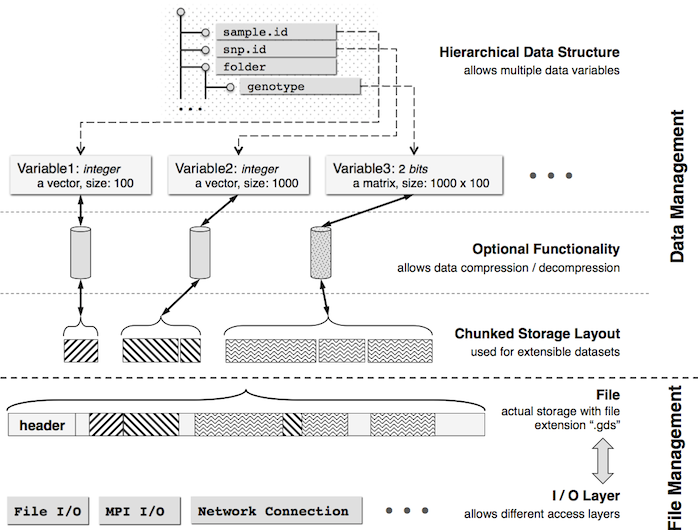

# Overview

In the era of big data, thousands of gigabyte-size data sets are challenging scientists for data management, even on well-equipped hardware. Currently, next-generation sequencing techniques are being adopted to investigate common and rare variants, making the analyses of large-scale genotypic data challenging. For example, the 1000 Genomes Project Phase 1 has identified approximately 38 million single nucleotide polymorphisms (SNPs), 1.4 million short insertions and deletions, and more than 14,000 larger deletions from whole-genome sequencing technologies [1]. In the near future, new technologies, like third-generation whole-genome sequencing, will be enabling data to be generated at an unprecedented scale [2]. The Variant Call Format (VCF) was developed for the 1000 Genomes Project, which is a generic text format for storing DNA polymorphism data such as SNPs, insertions, deletions and structural variants, together with rich annotations [3]. However, this format is less efficient for large-scale analyses since numeric data have to be parsed from a text VCF file before further analyses. The computational burden associated with sequence variants is especially evident with large sample and variant sizes, and it requires efficient numerical implementation and data management.

Here I introduce a high-performance C++ computing library CoreArray ([http://corearray.sourceforge.net](http://corearray.sourceforge.net)) for big-data management of genome-wide variants [4]. CoreArray was designed for developing portable and scalable storage technologies for bioinformatics data, allowing parallel computing at the multicore and cluster levels. It provides the genomic data structure (GDS) file format for array-oriented data: this is a universal data format to store multiple data variables in a single file. The CoreArray library modules are demonstrated in Figure 1. A hierarchical data structure is used to store multiple extensible data variables in the GDS format, and all datasets are stored in a single file with chunked storage layout. The C++ CoreArray library is implemented in the R/Bioconductor package [gdsfmt](http://www.bioconductor.org/packages/release/bioc/html/gdsfmt.html) with a tutorial [http://corearray.sourceforge.net/tutorials/gdsfmt/](http://corearray.sourceforge.net/tutorials/gdsfmt/).

Here, I focus on the application of CoreArray for statisticians working in the R environment, and developed R packages [gdsfmt](http://www.bioconductor.org/packages/release/bioc/html/gdsfmt.html) and [SeqArray](http://www.bioconductor.org/packages/release/bioc/html/SeqArray.html) to address or reduce the computational burden associated with data management of sequence variants. The gdsfmt package provides a general R interface for the CoreArray library, and [SeqArray](http://www.bioconductor.org/packages/release/bioc/html/SeqArray.html) is specifically designed for data management of sequence variants. The kernels of gdsfmt and SeqArray were written in C/C++ and highly optimized. Genotypic data and annotations are stored in a binary and array-oriented manner, offering efficient access of genetic variants using the R language. There are several key functions in SeqArray (Table 1), and most of data analyses could be done using these functions. The 1000 Genomes Project Phase 1 released 39 million genetic variants for 1092 individuals, and a 26G data file was created by SeqArray to store sequence variants with phasing information, where 2 bits were used as a primitive data type. The file size can be further reduced to 1.5G by compression algorithms without sacrificing access efficiency, since it has a large proportion of rare variants.

[SeqArray](http://www.bioconductor.org/packages/release/bioc/html/SeqArray.html) will be of great interest to scientists involved in data analyses of large-scale genomic sequence data using R environment, particularly those with limited experience of low-level C programming and parallel computing.




**Figure 1**: CoreArray library modules.

~


**Table 1**: The key functions in the SeqArray package.

| Function     | Description |
|:-------------|:-------------------------------------------|
| seqVCF2GDS   | Imports VCF files. [](http://zhengxwen.github.io/SeqArray/release/help/seqVCF2GDS.html)  |
| seqSummary   | Gets the summary (Num. of samples, Num. of variants, INFO/FORMAT variables, etc). [](http://zhengxwen.github.io/SeqArray/release/help/seqSummary.html)  |
| seqSetFilter | Sets a filter to sample or variant (i.e., define a subset of data). [](http://zhengxwen.github.io/SeqArray/release/help/seqSetFilter.html)  |
| seqGetData   | Gets data from a GDS file (from a subset of data). [](http://zhengxwen.github.io/SeqArray/release/help/seqGetData.html)  |
| seqApply     | Applies a user-defined function over array margins. [](http://zhengxwen.github.io/SeqArray/release/help/seqApply.html)  |
| seqParallel  | Applies functions in parallel. [](http://zhengxwen.github.io/SeqArray/release/help/seqParallel.html)  |

~


# Preparing Data

## Data formats used in SeqArray

To support efficient memory management for genome-wide numerical data, the [gdsfmt](http://www.bioconductor.org/packages/release/bioc/html/gdsfmt.html) package provides the genomic data structure (GDS) file format for array-oriented bioinformatic data based on the CoreArray library, which is a container for storing genotypic and annotation data. The GDS format supports data blocking so that only the subset of data that is being processed needs to reside in memory.

```{r}
# load the R package SeqArray
library(SeqArray)
```

Here is a typical GDS file shipped with the SeqArray package:
```{r}
gds.fn <- seqExampleFileName("gds")
# or gds.fn <- "C:/YourFolder/Your_GDS_File.gds"
gds.fn

seqSummary(gds.fn)
```
`seqExampleFileName()` returns the file name of a GDS file used as an example in [SeqArray](http://www.bioconductor.org/packages/release/bioc/html/SeqArray.html), and it is a subset of data from the 1000 Genomes Project. `seqSummary()` summarizes the genotypes and annotations stored in the GDS file.

```{r}
# open a GDS file
genofile <- seqOpen(gds.fn)

# display the contents of the GDS file in a hierarchical structure
genofile
```

For those who would like to know how variable-length genotypic data and annotations are stored in an array-oriented manner, `print(, all=TRUE)` displays all contents including hidden structures:
```{r}
# display all contents of the GDS file
print(genofile, all=TRUE, attribute=TRUE, attribute.trim=FALSE)

# close the GDS file
seqClose(genofile)
```

The output lists all variables stored in the GDS file. At the first level, it stores variables `sample.id`, `variant.id`, etc. The additional information are displayed in the square brackets indicating data type, size, compressed or not + compression ratio, where `Bit2` indicates that each byte encodes up to four alleles since one byte consists of eight bits, and `VStr8` indicates variable-length character. The annotations are stored in the directory `annotation`, which includes the fields of ID, QUAL, FILTER, INFO and FORMAT corresponding to the original VCF file(s). All of the functions in [SeqArray](http://www.bioconductor.org/packages/release/bioc/html/SeqArray.html) require a minimum set of variables in the annotation data:

1. `sample.id`, a unique identifier for each sample.
2. `variant.id`, a unique identifier for each variant.
3. `position`, integer, the base position of each variant on the chromosome, and 0 or NA for unknown position.
4. `chromosome`, character, the chromosome code, e.g., 1-22 for autosomes, X, Y, XY (the pseudoautosomal region), M (the mitochondrial probes), and `` (a blank string) for probes with unknown chromosome.
5. `allele`, character, reference and alternative alleles using comma as a separator.
6. `genotype`, a folder:
    1. `data`, a 3-dimensional array for genotypic data, the first dimension refers to the number of ploidy, the second is sample and the third is variant.
    2. `~data`, an optional variable, the transposed array according to `data`, the second dimension is variant and the third is sample.
    3. `@data`, the index for the variable `data`, and the prefix `@` is used to indicate the index. It should be equal-size as `variant.id`, which is used to specify the data size of each variant.
    4. `extra.index`, an index (3-by-$*$) matrix for triploid call (look like `0/0/1` in the VCF file). E.g., for `0/0/1`, the first two alleles are stored in `data`, and the last allele is saved in the variable `extra`. For each column of `extra.index`, the first value is the index of sample (starting from 1), the second value is the index of variant (starting from 1), and the last value is how many alleles remain (usually it is 1 since the first two alleles are stored in `data`) that indicates how many alleles stored in `extra` contiguously.
    5. `extra`, one-dimensional array, the additional data for triploid call, each allele block corresponds to each column in `extra.index`.

The optional folders include `phase` (phasing information), `annotation`, and `sample.annotation`.

* The folder `phase` includes:

1. `data`, a matrix or 3-dimensional array for phasing information. `0` for unphased status and `1` for phased status. If it is a matrix, the first dimension is sample and the second is variant, corresponding to diploid genotypic data. If it is a 3-dimensional array, the first dimension refers to the number of ploidy minus one. More details about `/` and `|` in a VCF file can be founded: [VCF format](http://www.1000genomes.org/wiki/analysis/variant-call-format).
2. `~data`, an optional variable, the transposed array according to `data`, the second dimension is variant and the third is sample.
3. `extra.index`, an index (3-by-$*$) matrix for triploid call (look like `0/0/1` in the VCF file). E.g., for `0/0/1`, the first separator (`/` here) is stored in `data`, and the last separator is saved in the variable `extra`. For each column of `extra.index`, the first value is the index of sample (starting from 1), the second value is the index of variant (starting from 1), and the last value is how many separators remain (usually it is 1 since the first separator is stored in `data`) that indicates how many separator stored in `extra` contiguously.
4. `extra`, one-dimensional array, the additional data of separator indicator for triploid call, each separator block corresponds to each column in `extra.index`.

* The folder `annotation` includes:

1. `id`, ID semi-colon separated list of unique identifiers where available. If this is a dbSNP variant it is encouraged to use the rs number(s). No identifier should be present in more than one data record. If there is no identifier available, then a blank string is used.
2. `qual`, phred-scaled quality score for the assertion made in ALT.
3. `filter`, PASS if this position has passed all filters, i.e. a call is made at this position.
4. `info`, additional information for each variant, according to the INFO field in a VCF file,
    1. `VARIABLE_NAME`, variable. If it is fixed-length, missing value indicates that there is no entry for that variant in the VCF file.
    2. `@VARIABLE_NAME` (*optional*). If `VARIABLE_NAME` is variable-length, one-dimensional array. The prefix `@` is used to indicate the index data. It should be equal-size as `variant.id`, which is used to specify the data size of each variant.
    3. `OTHER_VARIABLES`, ...
5. `format`, additional information for each variant and sample, according to the FORMAT field in a VCF file,
    1. `VARIABLE_NAME`, a folder,
        1. `data`, a $n_{samp}$-by-$*$ matrix.
        2. `~data`, an optional variable, the transposed array according to `data`.
        3. `@data`, one-dimensional array, the index data for the variable `data`, and the prefix `@` is used to indicate the index data. It should be equal-size as `variant.id`, which is used to specify the data size of each variant.
    2. `OTHER_VARIABLES`, ...

* The folder `sample.annotation` contains variables of vector or matrix according to `sample.id`.


## Format conversion from VCF files

The [SeqArray](http://www.bioconductor.org/packages/release/bioc/html/SeqArray.html) package provides a function `seqVCF2GDS()` to reformat a VCF file, and it allows merging multiple VCF files during format conversion. The genotypic and annotation data are stored in a compressed manner.

```{r}
# the VCF file, using the example in the SeqArray package
vcf.fn <- seqExampleFileName("vcf")
# or vcf.fn <- "C:/YourFolder/Your_VCF_File.vcf"
vcf.fn

# parse the header
seqVCF.Header(vcf.fn)
```

The columns `Number`, `Type` and `Description` are defined by the 1000 Genomes Project: [VCF format](http://www.1000genomes.org/wiki/Analysis/Variant Call Format/vcf-variant-call-format-version-41). Briefly, the Number entry is an Integer that describes the number of values that can be included with the INFO field. For example, if the INFO field contains a single number, then this value should be 1; if the INFO field describes a pair of numbers, then this value should be 2 and so on. If the field has one value per alternate allele then this value should be `A`; if the field has one value for each possible genotype then this value should be `G`.  If the number of possible values varies, is unknown, or is unbounded, then this value should be `.`. The `Flag` type indicates that the INFO field does not contain an entry, and hence the Number should be 0 in this case. Possible Types for FORMAT fields are: Integer, Float, Character, and String (this field is otherwise defined precisely as the INFO field).

```{r}
# convert, save in "tmp.gds"
seqVCF2GDS(vcf.fn, "tmp.gds")

# maximize the compression level
seqVCF2GDS(vcf.fn, "tmp.gds", storage.option=seqStorage.Option("ZIP_RA.max"))

seqSummary("tmp.gds")
```

```{r echo=FALSE}
unlink("tmp.gds")
```


## Export to a VCF File

The [SeqArray](http://www.bioconductor.org/packages/release/bioc/html/SeqArray.html) package provides a function `seqGDS2VCF()` to export data to a VCF file. The arguments `info.var` and `fmt.var` in `seqGDS2VCF` allow users to specify the variables listed in the INFO and FORMAT fields of VCF format, or remove the INFO and FORMAT information. `seqSetFilter()` can be used to define a subset of data for the export.

```{r}
# the file of GDS
gds.fn <- seqExampleFileName("gds")
# or gds.fn <- "C:/YourFolder/Your_GDS_File.gds"

# open a GDS file
genofile <- seqOpen(gds.fn)

# convert
seqGDS2VCF(genofile, "tmp.vcf.gz")
# read
z <- readLines("tmp.vcf.gz", n=20)
for (i in z) cat(substr(i, 1, 76), " ...\n", sep="")

# output BN,GP,AA,HM2 in INFO (the variables are in this order), no FORMAT
seqGDS2VCF(genofile, "tmp2.vcf.gz", info.var=c("BN","GP","AA","HM2"),
    fmt.var=character())
# read
z <- readLines("tmp2.vcf.gz", n=15)
for (i in z) cat(substr(i, 1, 56), " ...\n", sep="")

# close the GDS file
seqClose(genofile)
```

Users can use `diff`, a command line tool in Unix-like systems, to compare files line by line, in order to confirm data consistency.
```sh
# assuming the original VCF file is old.vcf.gz,
# call "seqVCF2GDS" for the import and "seqGDS2VCF" for the export to create a new VCF file new.vcf.gz
$ diff <(zcat old.vcf.gz) <(zcat new.vcf.gz)
# OR
$ diff <(gunzip -c old.vcf.gz) <(gunzip -c new.vcf.gz)
```

```
1a2,3
> ##fileDate=20130309
> ##source=SeqArray_RPackage_v1.0

# LOOK GOOD! There are only two lines different, and both are in the header.
```

```{r}
# delete temporary files
unlink(c("tmp.vcf.gz", "tmp1.vcf.gz", "tmp2.vcf.gz"))
```


## Modification

The [SeqArray](http://www.bioconductor.org/packages/release/bioc/html/SeqArray.html) package provides a function `seqDelete()` to
remove data annotations in the INFO and FORMAT fields. It is suggested to use `cleanup.gds()` in the [gdsfmt](http://www.bioconductor.org/packages/release/bioc/html/gdsfmt.html) package after calling `seqDelete()` to reduce the file size. For example,

```{r}
# the file of VCF
vcf.fn <- seqExampleFileName("vcf")
# or vcf.fn <- "C:/YourFolder/Your_VCF_File.vcf"

# convert
seqVCF2GDS(vcf.fn, "tmp.gds", verbose=FALSE)

# make sure that open with "readonly=FALSE"
genofile <- seqOpen("tmp.gds", readonly=FALSE)

# display the original structure
genofile

# delete "HM2", "HM3", "AA", "OR" and "DP"
seqDelete(genofile, info.varname=c("HM2", "HM3", "AA", "OR"),
    format.varname="DP")

# display
genofile

# close the GDS file
seqClose(genofile)

# clean up the fragments to reduce the file size
cleanup.gds("tmp.gds")
```

```{r echo=FALSE}
unlink("tmp.gds")
```


# Data Processing

## Functions for Data Analysis

**Table 2**: A list of functions for data analysis.

| Function       | Description |
|:---------------|:-------------------------------------------|
| seqGetData     | Gets data from a sequence GDS file (from a subset of data). [](http://zhengxwen.github.io/SeqArray/release/help/seqGetData.html)  |
| seqApply       | Applies a user-defined function over array margins. [](http://zhengxwen.github.io/SeqArray/release/help/seqApply.html)  |
| seqNumAllele   | Numbers of alleles per site. [](http://zhengxwen.github.io/SeqArray/release/help/seqNumAllele.html)  |
| seqMissing     | Missing genotype percentages. [](http://zhengxwen.github.io/SeqArray/release/help/seqMissing.html)  |
| seqAlleleFreq  | Allele frequencies. [](http://zhengxwen.github.io/SeqArray/release/help/seqAlleleFreq.html)  |
| seqAlleleCount | Allele counts. [](http://zhengxwen.github.io/SeqArray/release/help/seqAlleleCount.html)  |
| ...            | [](http://zhengxwen.github.io/SeqArray/release/help/00Index.html)  |

~

## Get Data

```{r}
# open a GDS file
gds.fn <- seqExampleFileName("gds")
genofile <- seqOpen(gds.fn)
```

It is suggested to use `seqGetData()` to take out data from the GDS file since this function can take care of variable-length data and multi-allelic genotypes, although users could also use `read.gdsn()` in the [gdsfmt](http://www.bioconductor.org/packages/release/bioc/html/gdsfmt.html) package to read data.

```{r}
# take out sample id
head(samp.id <- seqGetData(genofile, "sample.id"))

# take out variant id
head(variant.id <- seqGetData(genofile, "variant.id"))

# get "chromosome"
table(seqGetData(genofile, "chromosome"))

# get "allele"
head(seqGetData(genofile, "allele"))

# get "annotation/info/GP"
head(seqGetData(genofile, "annotation/info/GP"))

# get "sample.annotation/family"
head(seqGetData(genofile, "sample.annotation/family"))
```

Users can set a filter to samples and/or variants by `seqSetFilter()`. For example, a subset consisting of three samples and four variants:
```{r}
# set sample and variant filters
seqSetFilter(genofile, sample.id=samp.id[c(2,4,6)])
set.seed(100)
seqSetFilter(genofile, variant.id=sample(variant.id, 4))

# get "allele"
seqGetData(genofile, "allele")
```

Get genotypic data, it is a 3-dimensional array with respect to allele, sample and variant. `0` refers to the reference allele (or the first allele in the variable `allele`), `1` for the second allele, and so on, while NA is missing allele.
```{r}
# get genotypic data
seqGetData(genofile, "genotype")
```

Now let us take a look at a variable-length dataset `annotation/info/AA`, which corresponds to the INFO column in the original VCF file. There are four variants, each variant has data with size ONE (`$length`), and data are saved in `$data` contiguously.
`$length` could be ZERO indicating no data for that variant.
```{r}
# get "annotation/info/AA", a variable-length dataset
seqGetData(genofile, "annotation/info/AA")
```

Another variable-length dataset is `annotation/format/DP` corresponding to the FORMAT column in the original VCF file. Again, `$length` refers to the size of each variant, and data are saved in `$data` contiguously with respect to the dimension `variant`. `$length` could be ZERO indicating no data for that variant.
```{r}
# get "annotation/format/DP", a variable-length dataset
seqGetData(genofile, "annotation/format/DP")
```


## Apply Functions Over Array Margins

[SeqArray](http://www.bioconductor.org/packages/release/bioc/html/SeqArray.html) provides `seqApply()` to apply a user-defined function over array margins, which is coded in C++. It is suggested to use `seqApply()` instead of `apply.gdsn()` in the [gdsfmt](http://www.bioconductor.org/packages/release/bioc/html/gdsfmt.html) package, since this function can take care of variable-length data and multi-allelic genotypes. For example, reading the two variables `genotype` and `annotation/id` variant by variant:
```{r}
# set sample and variant filters
set.seed(100)
seqSetFilter(genofile, sample.id=samp.id[c(2,4,6)],
    variant.id=sample(variant.id, 4))

# read multiple variables variant by variant
seqApply(genofile, c(geno="genotype", id="annotation/id"),
    FUN=print, margin="by.variant", as.is="none")

# read genotypes sample by sample
seqApply(genofile, "genotype",
    FUN=print, margin="by.sample", as.is="none")

seqApply(genofile, c(sample.id="sample.id", genotype="genotype"),
    FUN=print, margin="by.sample", as.is="none")
```

```{r}
# remove the sample and variant filters
seqResetFilter(genofile)

# get the numbers of alleles per variant
z <- seqApply(genofile, "allele",
    FUN=function(x) length(unlist(strsplit(x,","))), as.is="integer")
table(z)
```

Another example is to use the argument `var.index` in the function `seqApply()` to include external information in the analysis, where the variable `index` in the user-defined `FUN` is an index of the specified dimension starting from 1 (e.g., variant).
```{r}
HM3 <- seqGetData(genofile, "annotation/info/HM3")

# Now HM3 is a global variable
# print out RS id if the frequency of reference allele is less than 0.5% and it is HM3
seqApply(genofile, c(geno="genotype", id="annotation/id"),
    FUN = function(index, x) {
        p <- mean(x$geno == 0, na.rm=TRUE)  # the frequency of reference allele
        if ((p < 0.005) & HM3[index]) print(x$id)
    }, as.is="none", var.index="relative", margin="by.variant")
```


## Apply Functions in Parallel

Now, let us consider an example of calculating the frequency of reference allele, and this calculation can be done using `seqApply()` and `seqParallel()`. Let's try the uniprocessor implementation first.
```{r}
# calculate the frequency of reference allele,
afreq <- seqApply(genofile, "genotype", FUN=function(x) mean(x==0, na.rm=TRUE),
    as.is="double", margin="by.variant")
length(afreq)
summary(afreq)
```

A multi-process implementation:
```{r}
# load the "parallel" package
library(parallel)

# choose an appropriate cluster size (or # of cores)
seqParallelSetup(2)

# run in parallel
afreq <- seqParallel(, genofile, FUN = function(f) {
        seqApply(f, "genotype", as.is="double", FUN=function(x) mean(x==0, na.rm=TRUE))
    }, split = "by.variant")

length(afreq)
summary(afreq)

# Close the GDS file
seqClose(genofile)
```


# Examples

In this section, a GDS file shipped with the package is used as an example:
```{r}
# open a GDS file
gds.fn <- seqExampleFileName("gds")
genofile <- seqOpen(gds.fn)
```

## The performance of seqApply

Let us try three approaches to export unphased genotypes: 1) the for loop in R; 2) vectorize the function in R; 3) the for loop in `seqApply()`. The function `seqApply()` has been highly optimized by blocking the computations to exploit the high-speed memory instead of disk. The results of running times (listed as follows) indicate that `seqApply()` works well and is comparable with vectorization in R (the benchmark in R_v3.0).

1. the for loop in R:

```R
system.time({
    geno <- seqGetData(genofile, "genotype")
    gc <- matrix("", nrow=dim(geno)[2], ncol=dim(geno)[3])
    for (i in 1:dim(geno)[3])
    {
        for (j in 1:dim(geno)[2])
        gc[j,i] <- paste(geno[1,j,i], geno[2,j,i], sep="/")
    }
    gc[gc == "NA/NA"] <- NA
    gc
})

   user  system elapsed
  2.185   0.019   2.386       <- the function takes 2.4 seconds

dim(gc)
[1]   90 1348

table(c(gc))
  0/0   0/1   1/0   1/1  <NA> 
88350  7783  8258  8321  8608 
```

2. Vectorize the function in R:

```R
system.time({
    geno <- seqGetData(genofile, "genotype")
    gc <- matrix(paste(geno[1,,], geno[2,,], sep="/"),
        nrow=dim(geno)[2], ncol=dim(geno)[3])
    gc[gc == "NA/NA"] <- NA
    gc
})

   user  system elapsed
  0.134   0.002   0.147       <- the function takes 0.15 seconds
```

3. the for loop in `seqApply()`:

```R
system.time({
    gc <- seqApply(genofile, "genotype",
        function(x) { paste(x[1,], x[2,], sep="/") },
        margin="by.variant", as.is="list")
    gc2 <- matrix(unlist(gc), ncol=length(gc))
    gc2[gc2 == "NA/NA"] <- NA
    gc2
})

   user  system elapsed
  0.157   0.002   0.168       <- the function takes 0.17 seconds
```


## Missing Rates

1. Calculate the missing rate per variant:

```{r}
m.variant <- local({
    # get ploidy, the number of samples and variants
    z <- seqSummary(genofile, "genotype")
    # dm[1] -- # of selected samples, dm[2] -- # of selected variants
    dm <- z$seldim
    # ploidy
    ploidy <- z$dim[1]

    # apply the function marginally
    m <- seqApply(genofile, "genotype", function(x) { sum(is.na(x)) },
        margin="by.variant", as.is="integer")

    # output
    m / (ploidy * dm[1])
})

length(m.variant)
summary(m.variant)

# Or call the function in SeqArray
summary(seqMissing(genofile, per.variant=TRUE))
```

2. Calculate the missing rate per sample:

```{r}
m.sample <- local({
    # get ploidy, the number of samples and variants
    z <- seqSummary(genofile, "genotype")
    # dm[1] -- # of selected samples, dm[2] -- # of selected variants
    dm <- z$seldim
    # ploidy
    ploidy <- z$dim[1]

    # need a global variable (only available in the bracket of "local")
    n <- integer(dm[1])

    # apply the function marginally
    # use "<<-" operator to find "n" in the parent environment
    seqApply(genofile, "genotype", function(x) { n <<- n + colSums(is.na(x)) },
        margin="by.variant", as.is="none")

    # output
    n / (ploidy * dm[2])
})

length(m.sample)
summary(m.sample)

# Or call the function in SeqArray
summary(seqMissing(genofile, per.variant=FALSE))
```


### Multi-process Implementation

```{r eval=FALSE}
# choose an appropriate cluster size (or # of cores)
seqParallelSetup(2)
```

1. Calculate the missing rate per variant:

```{r}
# run in parallel
m.variant <- local({
    # get ploidy, the number of samples and variants
    z <- seqSummary(genofile, "genotype")
    # dm[1] -- # of selected samples, dm[2] -- # of selected variants
    dm <- z$seldim
    # ploidy
    ploidy <- z$dim[1]

    # run in parallel
    m <- seqParallel(, genofile, FUN = function(f) {
        # apply the function marginally
        seqApply(f, "genotype", function(x) { sum(is.na(x)) },
            margin="by.variant", as.is="integer")
    }, split = "by.variant")

    # output
    m / (ploidy * dm[1])
})

summary(m.variant)
```

2. Calculate the missing rate per sample:

```{r}
m.sample <- local({
    # run in parallel
    m <- seqParallel(, genofile, FUN = function(f)
        {
            # dm[1] -- # of selected samples, dm[2] -- # of selected variants
            dm <- seqSummary(f, "genotype")$seldim

            # need a global variable (only available in the bracket of "local")
            n <- integer(dm[1])

            # apply the function marginally
            # use "<<-" operator to find "n" in the parent environment
            seqApply(f, "genotype", function(x) { n <<- n + colSums(is.na(x)) },
                margin="by.variant", as.is="none")

            # output
            n
        }, .combine = "+",     # sum all variables "n" of different processes
        split = "by.variant")

    # get ploidy, the number of samples and variants
    z <- seqSummary(genofile, "genotype")
    # dm[1] -- # of selected samples, dm[2] -- # of selected variants
    dm <- z$seldim
    # ploidy
    ploidy <- z$dim[1]

    # output
    m / (ploidy * dm[2])
})

summary(m.sample)
```


## Allele Frequency

**Calculate the frequency of reference allele:**

```{r}
# apply the function variant by variant
afreq <- seqApply(genofile, "genotype", function(x) { mean(x==0, na.rm=TRUE) },
    as.is="double", margin="by.variant")

length(afreq)
summary(afreq)

# Or call the function in SeqArray
summary(seqAlleleFreq(genofile, 0L))
```

### Multi-process Implementation

```{r eval=FALSE}
# choose an appropriate cluster size (or # of cores)
seqParallelSetup(2)
```

```{r}
# run in parallel
afreq <- seqParallel(, genofile, FUN = function(f) {
        seqApply(f, "genotype", as.is="double", FUN=function(x) mean(x==0, na.rm=TRUE))
    }, split = "by.variant")

length(afreq)
summary(afreq)
```


## Principal Component Analysis

In the principal component analysis, we employ the dosage of reference alleles to avoid confusion of multiple alleles. The genetic covariance matrix is defined as $M = [ m_{j,j'} ]$:
\[
    m_{j,j'} = \frac{1}{L} \sum_{l=1}^L
    	\frac{(g_{j,l} - 2p_l)(g_{j',l} - 2p_l)}{p_l (1 - p_l)}
\]
where $g_{j,l}$ is a genotype of individual $j$ at locus $l$ ($\in \{0,1,2\}$, Num. of reference allele), $p_l$ is the frequency of reference allele and there are $L$ loci in total.

```{r}
# genetic covariance matrix
genmat <- local({
    # get the number of samples and variants
    # dm[1] -- # of selected samples, dm[2] -- # of selected variants
    dm <- seqSummary(genofile, "genotype")$seldim

    # need a global variable (only available in the bracket of "local")
    s <- matrix(0.0, nrow=dm[1], ncol=dm[1])

    # apply the function variant by variant
    # use "<<-" operator to find "s" in the parent environment
    seqApply(genofile, "genotype", function(x) {
        g <- (x==0)                   # indicator of reference allele
        p <- mean(g, na.rm=TRUE)      # allele frequency
        g2 <- colSums(g) - 2*p        # genotypes adjusted by allele frequency
        m <- (g2 %o% g2) / (p*(1-p))  # genetic covariance matrix
        m[!is.finite(m)] <- 0         # correct missing values
        s <<- s + m                   # output to the global variable "s"
    }, margin="by.variant", as.is="none")

    # output, scaled by the trace of matrix "s" over the number of samples
    s / (sum(diag(s)) / dm[1])
})

# eigen-decomposition
eig <- eigen(genmat)

# eigenvalues
head(eig$value)
```

```{r fig.width=5, fig.height=5, fig.align='center'}
# eigenvectors
plot(eig$vectors[,1], eig$vectors[,2], xlab="PC 1", ylab="PC 2")
```


### Multi-process Implementation

```{r eval=FALSE}
# choose an appropriate cluster size (or # of cores)
seqParallelSetup(2)
```

```{r}
genmat <- seqParallel(, genofile, FUN = function(f)
    {
        # get the number of samples and variants
        # dm[1] -- # of selected samples, dm[2] -- # of selected variants
        dm <- seqSummary(f, "genotype")$seldim

        # need a global variable (only available in the bracket of "local")
        s <- matrix(0.0, nrow=dm[1], ncol=dm[1])

        # apply the function variant by variant
        # use "<<-" operator to find "s" in the parent environment
        seqApply(f, "genotype", function(x) {
            g <- (x==0)                   # indicator of reference allele
            p <- mean(g, na.rm=TRUE)      # allele frequency
            g2 <- colSums(g) - 2*p        # genotypes adjusted by allele frequency
            m <- (g2 %o% g2) / (p*(1-p))  # genetic covariance matrix
            m[!is.finite(m)] <- 0         # correct missing values
            s <<- s + m                   # output to the global variable "s"
        }, margin="by.variant", as.is="none")

        # output
        s
    }, .combine = "+",     # sum all variables "s" of different processes
    split = "by.variant")

# finally, scaled by the trace of matrix "s" over the number of samples
dm <- seqSummary(genofile, "genotype")$seldim
genmat <- genmat / (sum(diag(genmat)) / dm[1])

# eigen-decomposition
eig <- eigen(genmat)
# eigenvalues
head(eig$value)
```


## Individual Inbreeding Coefficient

To calculate an individual inbreeding coefficient using SNP genotype data, I demonstrate how to use `seqApply()` to calculate Visscher's estimator described in Yang *et al.* (2010) [5]. The estimator of individual inbreeding coefficient is defined as
\[
    \hat{\theta} = \frac{1}{L} \sum_{l=1}^L
        \frac{g_l^2 - g_l (1 + 2p_l) + 2p_l^2}{2 p_l (1 - p_l)}
\]
where $g_l$ is a SNP genotype at locus $l$ $\in \{0,1,2\}$ (Num. of reference allele), $p_l$ is the frequency of reference allele and there are $L$ loci in total.

```{r}
coeff <- local({
    # get the number of samples and variants
    # dm[1] -- # of selected samples, dm[2] -- # of selected variants
    dm <- seqSummary(genofile, "genotype")$seldim

    # need global variables (only available in the bracket of "local")
    n <- integer(dm[1])
    s <- double(dm[1])

    # apply the function variant by variant
    # use "<<-" operator to find "n" and "s" in the parent environment
    seqApply(genofile, "genotype", function(x) {
        p <- mean(x==0, na.rm=TRUE)      # allele frequency
        g <- colSums(x==0)               # genotypes: # of reference allele
        d <- (g*g - g*(1 + 2*p) + 2*p*p) / (2*p*(1-p))
        n <<- n + is.finite(d)           # output to the global variable "n"
        d[!is.finite(d)] <- 0
        s <<- s + d                      # output to the global variable "s"
    }, margin="by.variant", as.is="none")

    # output
    s / n
})

length(coeff)
summary(coeff)
```


### Multi-process Implementation

```{r eval=FALSE}
# choose an appropriate cluster size (or # of cores)
seqParallelSetup(2)
```

```{r}
coeff <- seqParallel(, genofile, FUN = function(f)
    {
        # get the number of samples and variants
        # dm[1] -- # of selected samples, dm[2] -- # of selected variants
        dm <- seqSummary(f, "genotype")$seldim

        # need global variables (only available in the bracket)
        n <- integer(dm[1])
        s <- double(dm[1])

        # apply the function variant by variant
        # use "<<-" operator to find "n" and "s" in the parent environment
        seqApply(f, "genotype", function(x) {
            p <- mean(x==0, na.rm=TRUE)      # allele frequency
            g <- colSums(x==0)               # genotypes: # of reference allele
            d <- (g*g - g*(1 + 2*p) + 2*p*p) / (2*p*(1-p))
            n <<- n + is.finite(d)           # output to the global variable "n"
            d[!is.finite(d)] <- 0
            s <<- s + d                      # output to the global variable "s"
        }, margin="by.variant", as.is="none")

        # output
        list(s=s, n=n)
    }, # sum all variables "s" and "n" of different processes
    .combine = function(x1,x2) { list(s = x1$s + x2$s, n = x1$n + x2$n) },
    split = "by.variant")

# finally, average!
coeff <- coeff$s / coeff$n

summary(coeff)
```

```{r}
# stop the cluster environment
seqParallelSetup(FALSE)
```


## Seamless R and C++ Integration

The Rcpp package provides R functions as well as a C++ library which facilitate the integration of R and C++.

```{r}
library(Rcpp)
```

The user can dynamically define an inline C/C++ function in R.
```{r}
cppFunction('double RefAlleleFreq(IntegerMatrix x)
{
    int nrow = x.nrow(), ncol = x.ncol();
    int cnt=0, zero_cnt=0, g;
    for (int i = 0; i < nrow; i++)
    {
        for (int j = 0; j < ncol; j++)
        {
            if ((g = x(i, j)) != NA_INTEGER)
            {
                cnt ++;
                if (g == 0) zero_cnt ++;
            }
        }
    }
    return double(zero_cnt) / cnt;
}')
```

Now, `RefAlleleFreq` is a function in R.
```{r}
RefAlleleFreq

afreq <- seqApply(genofile, "genotype", RefAlleleFreq,
    as.is="double", margin="by.variant")

summary(afreq)
```


```{r}
# close the GDS file
seqClose(genofile)
```


# Resources

1. CoreArray C++ project: [http://corearray.sourceforge.net/](http://corearray.sourceforge.net/)
2. gdsfmt R package: [http://github.com/zhengxwen/gdsfmt](http://github.com/zhengxwen/gdsfmt), [http://www.bioconductor.org/packages/release/bioc/html/gdsfmt.html](http://www.bioconductor.org/packages/release/bioc/html/gdsfmt.html)
3. SeqArray R package: [http://github.com/zhengxwen/SeqArray](http://github.com/zhengxwen/SeqArray), [http://www.bioconductor.org/packages/release/bioc/html/SeqArray.html](http://www.bioconductor.org/packages/release/bioc/html/SeqArray.html)


# Session Information

```{r}
sessionInfo()
```


# References

1. 1000 Genomes Project Consortium, Abecasis, G. R., Auton, A., Brooks, L. D., DePristo, M. A., Durbin, R. M., Handsaker, R. E., Kang, H. M., Marth, G. T., and McVean, G. A. An integrated map of genetic variation from 1,092 human genomes. *Nature* 491, 7422 (Nov 2012), 56--65.
2. Schadt, E. E., Linderman, M. D., Sorenson, J., Lee, L., and Nolan, G. P. Computational solutions to large-scale data management and analysis. *Nat Rev Genet* 11, 9 (Sep 2010), 647--657.
3. Danecek, P., Auton, A., Abecasis, G., Albers, C. A., Banks, E., DePristo, M. A., Handsaker, R. E., Lunter, G., Marth, G. T., Sherry, S. T., McVean, G., Durbin, R., and 1000 Genomes Project Analysis Group. The variant call format and vcftools. *Bioinformatics* 27, 15 (Aug 2011), 2156--2158.
4. Zheng X, Levine D, Shen J, Gogarten SM, Laurie C, Weir BS. A High-performance Computing Toolset for Relatedness and Principal Component Analysis of SNP Data. *Bioinformatics*. 2012 Oct 11.
5. Yang J, Benyamin B, McEvoy BP, Gordon S, Henders AK, Nyholt DR, Madden PA, Heath AC, Martin NG, Montgomery GW, Goddard ME, Visscher PM. 2010. Common SNPs explain a large proportion of the heritability for human height. *Nat Genet*. 42(7):565-9. Epub 2010 Jun 20.
